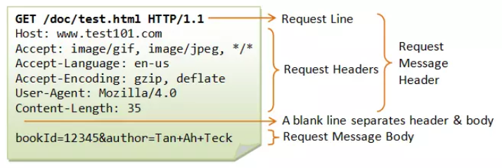
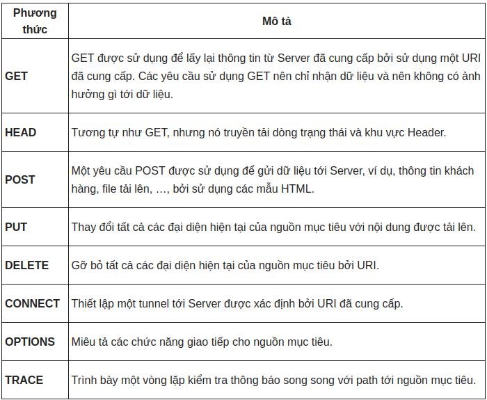
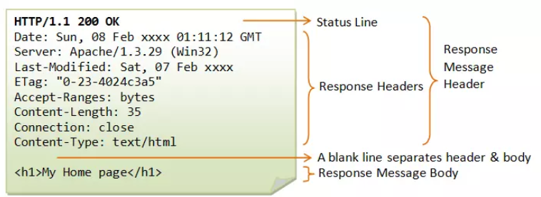

# HTTP protocol

What is URL? URL (Uniform Resource Locator) được sử dụng để xác định duy nhất một tài nguyên trên web

Struct of a URL: 
 
**protocol_name://hostname:port/path and file name**
 
 
Các thành phần chính của HTTP: **HTTP-Request** method and **HTTP-Response** method

### HTTP-Request method:
Cấu trúc của một HTTP-Request: 

 
<b>Request Line: Phương thức + URI–Request + Phiên bản HTTP
 

### HTTP-Response method:
Cấu trúc của một HTTP-Request:
 

 
Status line: Phiên bản HTTP + Mã trạng thái + Trạng thái