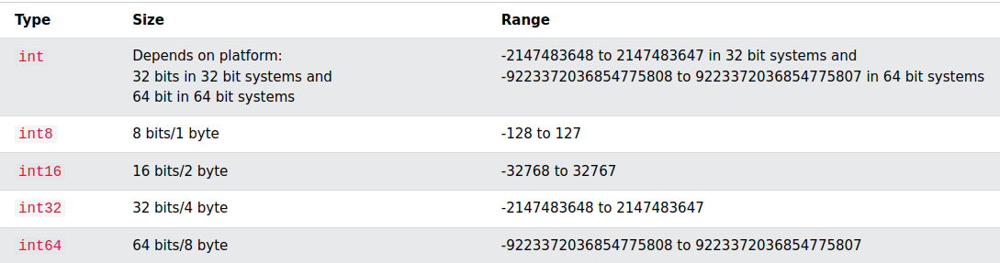
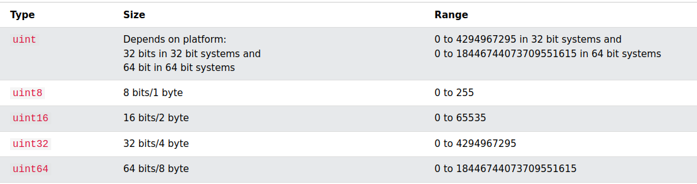
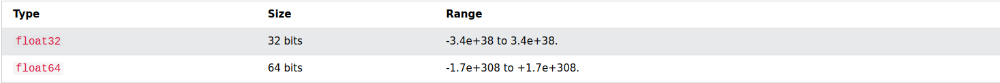

# Day 2

- Data types
- If statements, switch statements
- Loop

### Data types
*Go is a statically typed programming language, which means each variable has a type defined at first and can only hold values with that type. There are two categories of types in Go: basics types and composite types.*

- **int, int8, int16, int32, int64**
 

- **uint, uint8, uint16, uint32, uint64**
 

- **byte:** is an unsigned integer of type uint8 representing the ASCII character
- **rune:** is an integer of type int32 representing the Unicode character (UTF-8)
- **float32, float64**
 
float32: precision is 7 digits after the comma
 
float64: precision is 16 digits after the comma

- **uintptr:** is a large integer with size 8 bytes representing the address
- **bool:** has two values, true and false. Size of bool is 1 byte. If the declaration does not assign a value, the default is false

### If statements, If else statements, switch case statements
*Conditional statements are used to run code only if a certain condition is true*

### Loop
Go has only one looping construct, the for loop. The basic for loop has three components separated by semicolons:

    the init statement: executed before the first iteration
    the condition expression: evaluated before every iteration
    the post statement: executed at the end of every iteration

